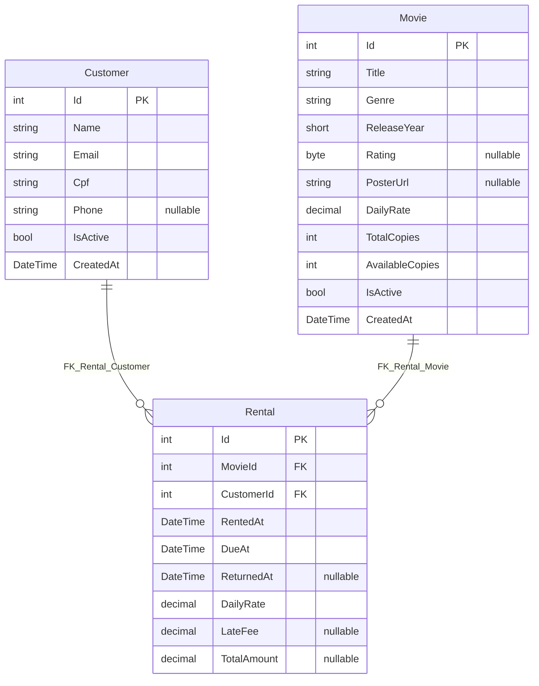

# Modelo de dados

_Gerado pelo CrudGen a partir do banco (o mesmo modelo que o scaffold lê). Não edite: rode `scripts/crudgen.ps1`._

```mermaid
erDiagram
    Customer {
        int Id PK
        string Name
        string Email
        string Cpf
        string Phone "nullable"
        bool IsActive
        DateTime CreatedAt
    }
    Movie {
        int Id PK
        string Title
        string Genre
        short ReleaseYear
        byte Rating "nullable"
        string PosterUrl "nullable"
        decimal DailyRate
        int TotalCopies
        int AvailableCopies
        bool IsActive
        DateTime CreatedAt
    }
    Rental {
        int Id PK
        int MovieId FK
        int CustomerId FK
        DateTime RentedAt
        DateTime DueAt
        DateTime ReturnedAt "nullable"
        decimal DailyRate
        decimal LateFee "nullable"
        decimal TotalAmount "nullable"
    }
    Customer ||--o{ Rental : "FK_Rental_Customer"
    Movie ||--o{ Rental : "FK_Rental_Movie"
```
